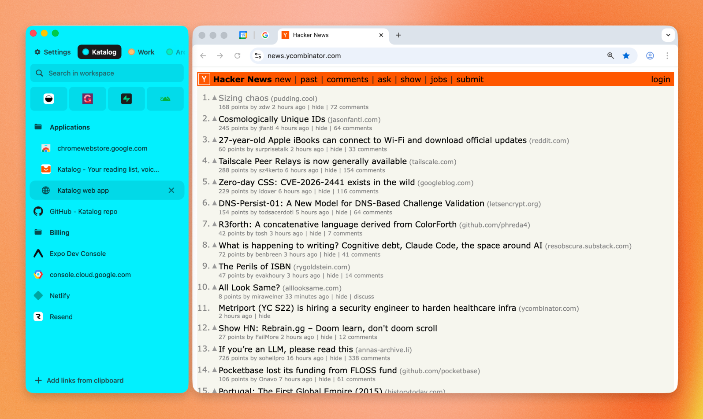
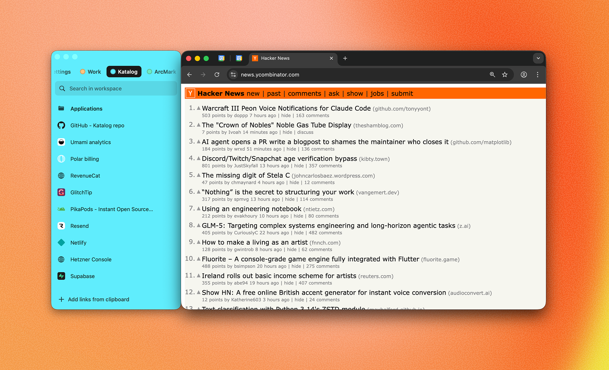
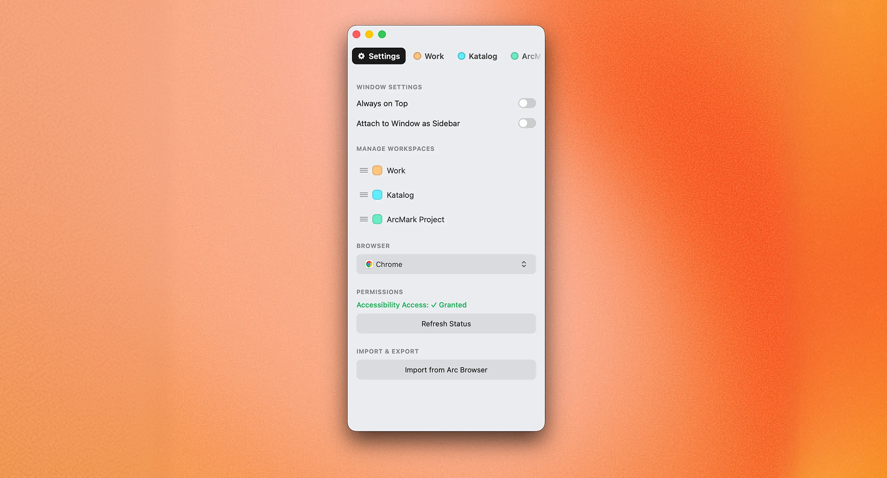

<p align="center">
  
</p>

<h1 align="center">MarklyAI</h1>

<p align="center">
  <strong>The AI-powered bookmark manager that lives inside your browser.</strong><br>
  A native macOS sidebar that organizes your links with intelligence — so you never lose a tab again.
</p>

<p align="center">
  <a href="https://github.com/pkmdev-sec/MarklyAI/releases/latest"></a>
  
  
  
  <a href="LICENSE"></a>
  <a href="https://github.com/pkmdev-sec/MarklyAI/stargazers"></a>
</p>

<br>

<p align="center">
  
</p>

---

## What is MarklyAI?

MarklyAI turns your macOS into a bookmark powerhouse. It's a **native AppKit application** that attaches directly to your browser window as a sidebar — Chrome, Arc, Safari, Brave, Edge — giving you an Arc-like workspace experience in any browser.

Drop a link. MarklyAI's AI reads it, categorizes it into the right workspace and folder, tags it, and fetches the favicon — all in under a second. No manual sorting. No bookmark chaos. Just organized knowledge at your fingertips.

**Built with Swift 6, powered by Claude AI, and designed for people who live in their browser.**

<br>

## Demo

https://github.com/user-attachments/assets/acc90f08-66c8-42de-9453-8699c2c2f47a

<br>

## Why MarklyAI?

| Problem | MarklyAI Solution |
|---|---|
| Browser bookmarks are a graveyard | AI auto-organizes links into workspaces and folders |
| Switching apps to manage links | Sidebar attaches directly to your browser window |
| No context for saved links | Auto-tagging, link previews, and health monitoring |
| Can't find anything | Command palette with semantic search (Cmd+K) |
| Manual organization is tedious | One-click capture with global hotkey (Cmd+Shift+L) |
| Locked into one browser | Works with Chrome, Arc, Safari, Brave, and Edge |

<br>

## Features

### AI-Powered Organization

MarklyAI uses the **Claude API** to intelligently categorize your bookmarks. Drop a link and the AI analyzes the page content, determines the best workspace and folder, and files it away — no manual sorting required.

- Smart categorization based on page content analysis
- Automatic folder suggestion and creation
- Context-aware placement across workspaces

### Browser Sidebar

The defining feature. MarklyAI **attaches to your browser window** as a sidebar and follows it across spaces and desktops. It feels like a native part of your browser.

- Attach to **Chrome, Arc, Safari, Brave, Edge**
- Left or right sidebar positioning
- Always-on-top mode for floating access
- Automatic window tracking across spaces

<p align="center">
  
</p>

### Workspace System

Organize your digital life into **color-coded workspaces** — one for work, one for side projects, one for research. Each workspace has its own folder hierarchy, color theme, and pinned tabs.

- 8 beautiful color themes (Blush, Apricot, Butter, Leaf, Mint, Sky, Periwinkle, Lavender)
- Nested folder hierarchies with unlimited depth
- Drag-and-drop between folders and workspaces
- Inline renaming with double-click
- Pinned tabs for quick access

### Quick Capture

Press **Cmd+Shift+L** from anywhere on your Mac. A floating panel appears — paste or type a URL, and it's instantly saved to your current workspace. No need to switch windows.

- Global hotkey works from any app
- Clipboard auto-detection for URLs
- Instant save to active workspace

### Command Palette

Press **Cmd+K** to open the command palette. Search across all your bookmarks using **semantic search** powered by Apple's NLEmbedding framework — find links by meaning, not just keywords.

- Semantic search across all workspaces
- Fuzzy matching for titles and URLs
- Instant keyboard-driven navigation

### Smart Auto-Tagging

MarklyAI uses Apple's **NaturalLanguage framework** to automatically extract tags from link content. Every bookmark gets contextual tags without any manual effort.

### Browser Imports

Switching from another browser or bookmark manager? Import everything in one click.

- **Arc Browser** — Recreates your exact workspace structure from `StorableSidebar.json`
- **Chrome** — Imports from Chrome's HTML bookmark export

### Spotlight Integration

All your bookmarks are indexed in **macOS Spotlight**. Search for any saved link from Spotlight, and jump straight to it.

### Link Health Monitoring

MarklyAI periodically checks your saved links and flags broken URLs. No more clicking dead bookmarks.

### Link Previews

Hover over any bookmark to see a rich preview — title, description, and favicon — fetched and cached automatically.

### Clipboard Intelligence

MarklyAI watches your clipboard for URLs. When you copy a link, it offers to save it to your current workspace with a single click.

### Siri & Shortcuts

Integrate MarklyAI into your automation workflows with **App Intents**. Save bookmarks, search workspaces, and more — all through Siri or the Shortcuts app.

<p align="center">
  
</p>

<br>

## Tech Stack

| Layer | Technology |
|---|---|
| Language | Swift 6.2 with strict concurrency |
| UI Framework | AppKit (native macOS) |
| AI Engine | Claude API (Anthropic) |
| Semantic Search | Apple NLEmbedding |
| Auto-Tagging | Apple NaturalLanguage |
| Spotlight | CoreSpotlight |
| Data Storage | Local JSON + favicon cache |
| Build System | Swift Package Manager + Swift Bundler |
| Distribution | Notarized DMG with Sparkle updates |

<br>

## Installation

### Download

Grab the latest release from the [Releases page](https://github.com/pkmdev-sec/MarklyAI/releases/latest).

1. Download the `.dmg` file
2. Open it and drag **MarklyAI.app** to **Applications**
3. Launch MarklyAI

### System Requirements

- macOS 13.0 (Ventura) or later
- Accessibility permissions for sidebar attachment (optional — works as standalone without it)

### Setup

For the browser sidebar feature, grant accessibility permissions:

**System Settings → Privacy & Security → Accessibility → Add MarklyAI**

Without this, MarklyAI works as a standalone bookmark manager window.

<br>

## Build from Source

### Prerequisites

- macOS 13.0+
- Swift 6.2+
- [Swift Bundler](https://swiftbundler.dev) — `mint install stackotter/swift-bundler@main`

### Build

```bash
git clone https://github.com/pkmdev-sec/MarklyAI.git
cd MarklyAI

# Build the app
./scripts/build.sh

# Build and create DMG installer
./scripts/build.sh --dmg

# Build and run
./scripts/run.sh
```

The built app is at `.build/bundler/MarklyAI.app`.

### Testing

```bash
swift test
```

<br>

## Architecture

MarklyAI follows a **unidirectional data flow** pattern:

```
User Action → AppModel (state mutation) → DataStore (persistence) → UI (reactive update)
```

- **AppModel** — Single source of truth for all application state
- **DataStore** — JSON persistence at `~/Library/Application Support/MarklyAI/`
- **Services** — Modular, `@MainActor` singletons for AI, favicons, browser integration, Spotlight, etc.
- **Components** — Reusable AppKit views built on `BaseControl`/`BaseView` base classes with a centralized design system

24,000+ lines of Swift across 54 source files. Zero SwiftUI — pure AppKit for maximum native performance.

<br>

## Contributing

Contributions are welcome.

- **Bug reports** — [Open an issue](https://github.com/pkmdev-sec/MarklyAI/issues)
- **Feature requests** — [Start a discussion](https://github.com/pkmdev-sec/MarklyAI/discussions)
- **Pull requests** — Fork, branch, and submit. See `CLAUDE.md` for architecture details.

<br>

## License

MIT License — see [LICENSE](LICENSE) for details.

---

<p align="center">
  <sub>Built with obsessive attention to detail by <a href="https://github.com/pkmdev-sec">@pkmdev-sec</a></sub>
</p>
